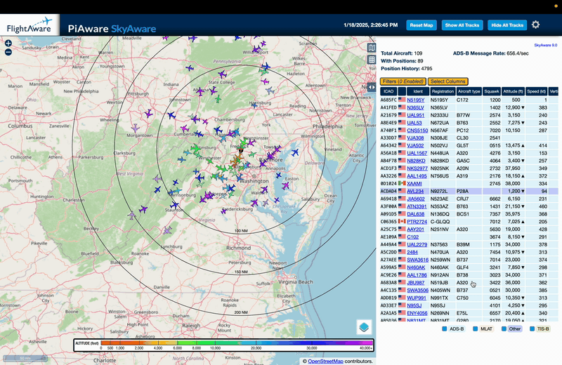

# SkyAware UI Enhancement

A userscript that modifies the SkyAware interface by making the heading row on the aircraft table sticky, freezes
the info block above it, and removes scrollbars while maintaining scrolling functionality.

Press Play to see it in action:

## Installation

1. Install [Tampermonkey](https://www.tampermonkey.net/) for your browser
2. [Click here to install with Tampermonkey](https://raw.githubusercontent.com/brianmcentire/skyaware-ui-userscript/main/skyaware-ui-enhance.user.js)
3. Refresh your SkyAware page

## Features

- Freezes header on the airplanes table so it stays visible while scrolling
- Hidden scrollbars with maintained functionality
- Preserved original styling and colors

## License

MIT © 2025 Brian McEntire
